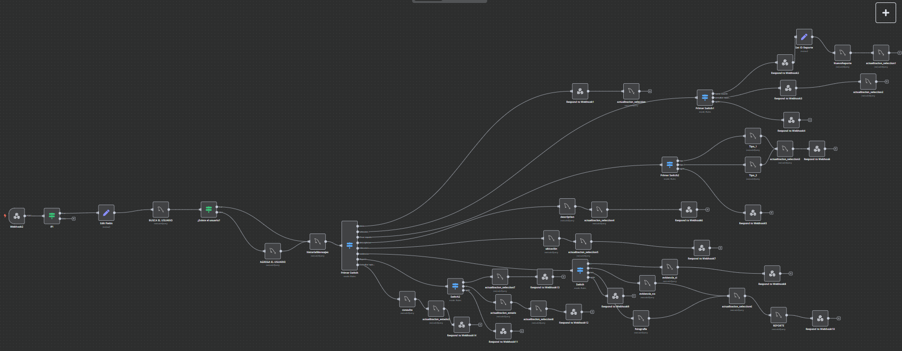

# Chatbot (React + n8n + WhatsApp + SQL)

**Documento dividido en dos partes:**

**A)** Documentación (contexto y funcionamiento)

**B)** Manual de implementación (montaje rápido).

---

# A) Documentación (contexto y funcionamiento)

## 1) Componentes del sistema

* **Frontend (React)**: dashboard con login, KPIs (*SummaryCards*), mapa de reportes, tabla filtrable (componentes en `src/components/*`).
* **API PHP (`/api/*.php`)**: scripts que **consultan la base de datos** y responden **JSON**; se **consumen por HTTP** desde React.
* **Bot WhatsApp (Baileys)**: recibe/manda mensajes; reenvía cada entrada a **n8n**; guarda media en `evidencias/` y la sesión en `baileys_auth/`.
* **n8n**: la lógica conversacional (IA/validaciones), guarda/consulta directo a BD.

## 2) Estructura de carpetas (resumen)

### Frontend – `CHATBOTWHATSAPP/`

```
CHATBOTWHATSAPP/
├─ api/                      # Endpoints PHP (se consumen vía HTTP)
│  ├─ actualizar_estado.php
│  ├─ get_historialmensajes.php
│  ├─ obtener_ciudadanos.php
│  ├─ obtener_reportes.php
│  ├─ resumen_reportes.php
│  └─ usuarios_api.php
├─ public/
├─ src/
│  ├─ assets/
│  ├─ components/
│  │  ├─ Login.jsx / Login.css
│  │  ├─ Menu.jsx / Navbar.jsx / Navbar.css
│  │  ├─ MapaReportes.jsx / MapaReportes.css
│  │  ├─ ReportesFiltrables.jsx / ReportesFiltrables.css
│  │  ├─ ReportesTable.jsx / ReportTable.jsx / TableEstilo.css
│  │  ├─
│  │  └─ SummaryCards.jsx / SummaryCards.css / Usuarios.jsx / Usuarios.css
│  ├─ utils/three-background.js
│  ├─ App.js / App.css
│  └─ index.js / index.css
└─ package.json
```

### Bot WhatsApp – `whatsapp-bot/`

```
whatsapp-bot/
├─ bailey_auth/        # sesión
├─ evidencias/         # media guardada
├─ index.js            # arranque del bot (config en el mismo archivo)
├─ guardarImagenLocal.js
└─ package.json
```

### n8n – `n8n/`




## 3) Flujo de datos (detalle)

1. **WhatsApp → Baileys → n8n**: el bot recibe texto/media, guarda evidencia (si aplica) y hace `POST` al Webhook de n8n con `{ text, wa_id, timestamp, media_path? }`.
2. **n8n (IA/validaciones)**: guía preguntas hasta completar campos requeridos,  **guarda/consulta** a BD.
3. **n8n → Baileys**: responde con el texto final al chat.
4. **Web (React)**: consume `/api/*.php` para mostrar KPIs, mapa y tablas en tiempo casi real.

## 4) Endpoints PHP (resumen funcional)

* `usuarios_api.php` – autenticación/usuarios.
* `obtener_reportes.php` – lista de reportes (admite filtros por fecha/estatus si aplica).
* `resumen_reportes.php` – KPIs para tarjetas.
* `get_historialmensajes.php` – historial por `wa_id` o `reporte_id`.
* `actualizar_estado.php` – transición de estatus del reporte.
* `obtener_ciudadanos.php` – catálogo/listado.

## 5) ¿Cómo **modificar** el flujo en n8n?

1. **Duplicar** el flujo (Save As) antes de cambios.
2. **Editar** el *system prompt* del **AI Agent** (tono, pasos, catálogo `tipo_reporte`).
3. **Actualizar** el esquema del **Structured Output Parser** (agregar/remover campos).
4. **Mapear** `id_departamento` (nodo Code/Switch/Set).
5. **Validar** con nodos `IF`; si falta un campo, regresar al Agent con pregunta puntual.
6. **Probar** con *Execute Workflow* (enviar JSON ejemplo).
7. **Activar** y **exportar** `workflow.json` para versionar.

---

# B) Manual de implementación (montaje rápido)

## 6) Prerrequisitos

* **Node.js** y npm.
* **PHP** (o servidor con PHP habilitado).
* Acceso a la **base de datos** utilizada por `/api`.
* Flujo **n8n** corriendo.
* Un número/dispositivo para **WhatsApp**.

## 7) Montaje local de desarrollo

### 7.1 API PHP

* Servir la carpeta `api/` con tu servidor PHP (XAMPP, WAMP, Apache/Nginx, etc.).
* Verifica conexión a BD dentro de cada `*.php` y que respondan JSON.

### 7.2 Frontend (React)

1. Dentro de `CHATBOTWHATSAPP/`:

```bash
npm install
```

2. Crear `.env` (Create React App) con la URL a tu API para **desarrollo**:

```
REACT_APP_API_URL=http://localhost/chatbotwhatsapp/api
```

3. Ejecutar:

```bash
npm start
```

4. **Producción**: crear `./.env.production` con tu dominio y construir:

```
REACT_APP_API_URL=https://tu-dominio.com/api
```

```bash
npm run build
```

### 7.3 Bot WhatsApp (Baileys)

1. En `whatsapp-bot/`:

```bash
npm install
```

2. Configurar **dentro de `index.js`** las constantes necesarias.
3. Ejecutar el bot y **escanear QR**:

```bash
node index.js
```

### 7.4 n8n

* Copiar la **URL del Webhook (POST)** y asegurarse de que coincide con la usada en `whatsapp-bot/index.js`.

## 8) Montaje en producción (idea general)

* **API PHP** y **build de React** bajo el **mismo dominio** (`/api` y `/`).
* **Bot** corriendo como proceso de fondo.
* **n8n** activo con el flujo en producción y Webhook accesible desde el bot.

## 9) Troubleshooting

* **React no carga datos**: revisa la URL de `REACT_APP_API_URL` y que `/api/*.php` respondan JSON.
* **Baileys desconectado**: eliminar `baileys_auth/` y volver a escanear el QR.
* **n8n no recibe**: flujo activado y Webhook correcto en `index.js`.

---